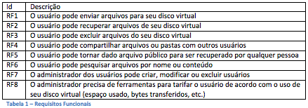
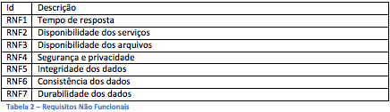
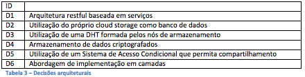
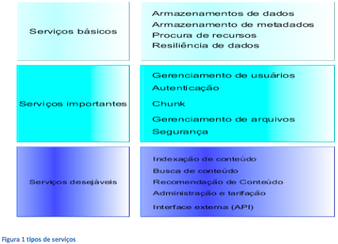
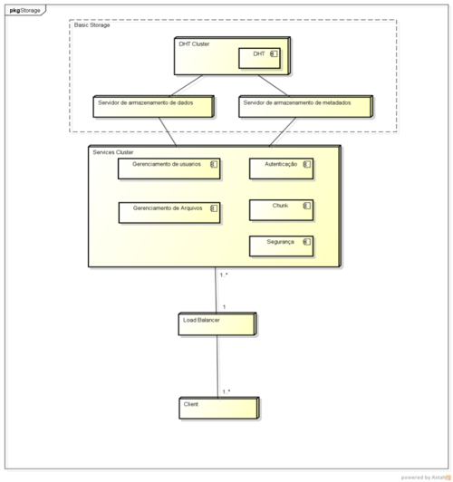

Desde o advento da Internet, o volume de dados armazenado por usuários tem crescido de forma exponencial. De acordo com um estudo realizado pela International Data Corporation (IDC) [Gantz 2011], o volume global de dados em 2011 era de 1.8 zetabytes e dobra a cada dois anos.

Outro fator importante é a popularização dos dispositivos portáteis, em que o usuário deseja armazenar e acessar seus dados de forma umbíqua.

Nessa nova era, chamada de Era do Zettabyte, surgem alguns desafios importantes para a área de Tecnologia da Informação. Tais como sincronizar dispositivos diferentes, manter dados com garantia, buscar dados dentro desse volume, entre outros.

Os chamados sistemas de File Cloud Storage vêm a resolver esse tipo de problema. São sistemas baseado no modelo de serviço Storage as a Service utilizados para armazenar arquivos.

Entretanto, construir um sistema de File Cloud Storage torna-se um grande desafio tecnológico, pois alguns requisitos funcionais não são fáceis de atender.

Para construir a arquitetura, temos que definir um conjunto de requisitos funcionais e não funcionais. Esses requisitos foram levantados observando os principais sistemas de file cloud storage do mercado, assim como foram observadas algumas características de bancos de dados relacionais e não relacionais.
A Tabela 1 mostra os requisitos funcionais para aplicação. Basicamente, são requisitos relacionados com a operação de arquivos em um sistema de arquivo, com exceção dos requisitos RF7 e RF8, que estão relacionados com a administração do sistema.

Na Tabela 2 é mostrada a relação dos requisitos não funcionais. A maioria deles é comum a requisitos de bancos de dados pois, de certa forma, os mesmos também são storage engines.

Com a definição dos dados, podemos listar algumas decisões arquiteturais.  A Tabela 3 mostra as principais decisões arquiteturas que foram tomadas durante o desenvolvimento da arquitetura.

Na arquitetura, podemos agrupar os serviços em três camadas: Serviços básicos, serviços importantes e serviços desejáveis. Através dos serviços básicos, podemos compor uma storage engine que armazena e recupera dados no formato chave-valor. Garantindo a durabilidade, disponibilidade, integridade e consistência dos dados. Com a adição dos serviços importantes, podemos compor um File Cloud Storage propriamente dito, realizando operações sobre arquivos. Por fim, adicionando os serviços desejáveis, podemos adicionar algumas features adicionais ao sistema de cloud storage. A Figura 1 mostra a composição dos serviços em camadas.

A Figura 2 mostra a visão geral do sistema. Temos uma DHT formada por vários nós de armazenamento que estão organizados formando um anel, em uma estrutura semelhante ao DynamoDB (DeCandia, 2007) com o serviço de armazenamento de dados e de metadados provendo uma interface para serviços.

No nível do Cluster de serviços são implementados os serviços básicos, utilizando o Basic Storage tanto como armazenamento de dados como também de metadados.

O serviço de Gerenciamento de usuários armazena todos os dados sobre os usuários e seu sistema de arquivo virtual. O serviço de autenticação permite que os usuários se identifiquem para o sistema, garantindo assim um acesso seguro. O serviço de gerenciamento de arquivos é o disco virtual do usuário propriamente dito, onde é possível fazer operações semelhantes a um sistema de arquivos em disco.

Para facilitar o controle de operações como replicação, armazenamento e recuperação, os arquivos são repartidos em pedaços menores denominados chunks. O serviço de Chunk é responsável pelo armazenamento e recuperação dos chunks que compõem cada arquivo.

O serviço de segurança utiliza um sistema de chave pública e privada para garantir a confidencialidade e segurança dos dados, assim como permitir também o compartilhamento entre usuários.

Para garantir que a arquitetura de fato, resolva o problema proposto, será necessário desenvolver uma avaliação arquitetural, em que pessoas com experiência comprovada na área possam avaliar e propor melhorias na arquitetura do sistema.

Referências

* Gantz, J. (2011). The 2011 digital universe study: Extracting value from chaos.
* G. DeCandia, D. Hastorun, M. Jampani, G. Kakulapati, A. Lakshman, A. Pilchin, S. Sivasubramanian, P. Vosshall, and W. Vogels. Dynamo: amazon’s highly available keyvalue store. Proceedings of twenty-first ACM SIGOPS symposium on Operating systems principles, 205-220, 2007

Texto escrito por Thiago Jamir e Silva (tjs at cin.ufpe.br)